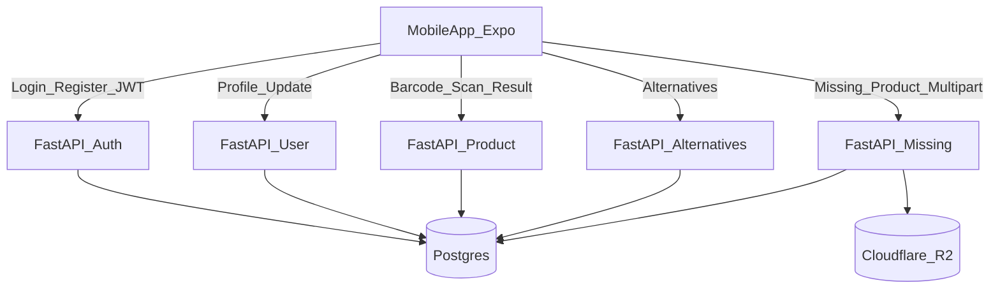

# TemizSepet MVP — User Story Bazlı Geliştirme Planı

## Varsayımlar ve sabitler
- Kod yapısı: **Backend ve Mobile ayrı (bağımsız) projeler**
  - Backend: FastAPI + PostgreSQL, ayrı deploy (örn. Render)
  - Mobile: React Native (Expo), Android hedefli, ayrı build/release (Play Store)
  - Bu workspace’te iki klasör altında tutulabilir (örn. `[backend/](backend/)` ve `[mobile/](mobile/)`), ancak CI/CD ve versiyonlama bağımsız kurgulanır.
- Storage: **Cloudflare R2** (S3-compatible API; boto3 ile)
- Auth: **Custom JWT** (access token) + **bcrypt** (şifre hash)
- DB: PostgreSQL + (SQLAlchemy 2.x async **veya** SQLModel). (MVP için SQLAlchemy async önerilir.)

## Önerilen yüksek seviye akış

---

## US 1.1: Kullanıcı Kaydı (Register)

### Kapsam
- SCR-02’de email/şifre ile kayıt
- Backend’de kullanıcı oluşturma, bcrypt hash, email unique
- Başarılı kayıt sonrası SCR-03’e yönlendirme

### Backend işleri
- **Proje iskeleti**
  - `[backend/app/main.py](backend/app/main.py)`: FastAPI app, router include
  - `[backend/app/core/config.py](backend/app/core/config.py)`: env ayarları (DB URL, JWT secret, R2)
  - `[backend/app/core/security.py](backend/app/core/security.py)`: bcrypt hash/verify, JWT encode/decode
  - `[backend/app/db/session.py](backend/app/db/session.py)`: async engine + sessionmaker
  - `[backend/app/db/models.py](backend/app/db/models.py)`: `User`, `Product`, `MissingProduct`
- **Auth endpoint’leri**
  - `[backend/app/routers/auth.py](backend/app/routers/auth.py)`
    - `POST /auth/register`
      - Input: `email`, `password`
      - Validasyon: email format, password min 8
      - İş: email unique kontrol → bcrypt hash → insert
      - Output: **201** + JWT access token (veya sadece 201 + user id; PRD token detayını zorlamıyor, ama login ile tutarlı olması için token döndürmek önerilir)
      - Hata: email mevcutsa **409**
- **Şema/Pydantic**
  - `[backend/app/schemas/auth.py](backend/app/schemas/auth.py)`: RegisterRequest, AuthResponse

### Mobile işleri (Expo)
- **Ekran**
  - `[mobile/src/screens/auth/login-register-screen.tsx](mobile/src/screens/auth/login-register-screen.tsx)`
    - Form state, validasyon (email format + password >=8)
    - UI state: Idle/Submitting/Error
- **API client**
  - `[mobile/src/lib/api.ts](mobile/src/lib/api.ts)`: base URL, fetch wrapper
  - `[mobile/src/features/auth/auth.api.ts](mobile/src/features/auth/auth.api.ts)`: register/login çağrıları
- **Token saklama**
  - `[mobile/src/features/auth/auth.store.ts](mobile/src/features/auth/auth.store.ts)`: Zustand store
  - Expo SecureStore ile access token persist (MVP)
- **Navigasyon**
  - `[mobile/src/navigation/index.tsx](mobile/src/navigation/index.tsx)`: Auth flow → Profile flow

### Test / Kabul doğrulama
- Backend
  - Register: 201, bcrypt hash doğrulama (db’de düz şifre olmamalı)
  - 409: aynı email ile ikinci kayıt
  - 422: invalid email / short password
- Mobile
  - Invalid input: API çağrısı yapılmadan hata
  - Success: SCR-03’e yönlendirme

---

## US 1.2: Sağlık Matrisini Güncelleme

### Kapsam
- SCR-03’te alerjenler, diyet tipi, istenmeyen maddeler seçimleri
- `PUT /user/profile` ile JSONB alanların güncellenmesi

### Backend işleri
- **Model alanları**
  - `Users.alerjenler` JSONB
  - `Users.diyet_tipi` string
  - `Users.istenmeyen_maddeler` JSONB
- **Auth dependency**
  - `[backend/app/deps/auth.py](backend/app/deps/auth.py)`: `get_current_user()` (JWT doğrula)
- **Endpoint**
  - `[backend/app/routers/user.py](backend/app/routers/user.py)`
    - `PUT /user/profile` (Authorization: Bearer)
    - Body örneği: `{ "allergens": ["laktoz"], "diet": "vegan", "undesired": ["palm yağı"] }`
    - DB update, **200** döndür

### Mobile işleri
- **Profil matrisi ekranı**
  - `[mobile/src/screens/profile/profile-matrix-screen.tsx](mobile/src/screens/profile/profile-matrix-screen.tsx)`
    - Büyük touch target’lı toggle/chip UI (design-system.md ilkeleri)
    - State: Fetching_Data (opsiyonel), Saving, Success
- **API + cache**
  - `[mobile/src/features/profile/profile.api.ts](mobile/src/features/profile/profile.api.ts)`
  - TanStack Query mutation + optimistic UI opsiyonel

### Test / Kabul doğrulama
- Backend: JWT’siz 401, valid payload ile DB JSONB güncelleniyor
- Mobile: kaydet → success feedback + sonraki ekran (SCR-04) geçiş

---

## US 2.1: Barkod Okuma Hızı (OCR)

### Kapsam
- SCR-05 kamera tarama
- Google ML Kit (cihaz üzerinde) ile 2 sn içinde okuma hedefi
- 5 sn içinde okunamazsa manuel barkod girişi
- Başarılı okumada haptic feedback

### Mobile işleri
- **Scanner ekranı**
  - `[mobile/src/screens/scanner/scanner-screen.tsx](mobile/src/screens/scanner/scanner-screen.tsx)`
    - Kamera izinleri state: Requesting_Permission
    - Barkod okuma state: Scanning
    - Timer: 5sn → manuel giriş UI aç
- **ML Kit entegrasyonu**
  - Expo’da ML Kit barkod için yaygın yaklaşım: `expo-camera` + `expo-barcode-scanner` (mümkünse) veya native module.
  - PRD “Google ML Kit Vision” dediği için: Expo managed workflow’da hangi kütüphaneyi kullanacağımızı netleştirip buna göre kurulum.
    - Plan: önce Expo uyumlu barkod tarama (performans ölçümü), gerekirse config plugin/native module.
- **Haptic**
  - `[mobile/src/lib/haptics.ts](mobile/src/lib/haptics.ts)` + `expo-haptics`

### Test / Kabul doğrulama
- Android cihaz testinde: typical barkodlarda 2 sn altı okuma
- 5 sn fail → manuel input görünür
- Başarılı okuma → haptic + otomatik sonuç çağrısı (US 2.2 endpoint)

---

## US 2.2: Fuzzy Matching ve Skorlama Algoritması

### Kapsam
- `GET /product/{barcode}` barkod ile ürün + kullanıcı profiline göre status: RED/YELLOW/GREEN
- RED: alerjen eşleşmesi (eşanlamlı dahil)
- YELLOW: alerjen yok ama istenmeyen madde var
- GREEN: hiçbir kısıt yok

### Backend işleri
- **Products tablosu**
  - `barkod` (PK), `ad`, `kategori`, `fiyat_segmenti`, `icerik` (Text)
- **Ürün çekme**
  - Barkod bulunamazsa: PRD net değil (missing flow US 3.2 var). Öneri: **404** ve mobile’da “ürün bulunamadı → eksik ürün bildir” CTA.
- **Fuzzy/synonym sözlüğü**
  - `[backend/app/core/ingredients_synonyms.py](backend/app/core/ingredients_synonyms.py)`
    - Örn: `{"laktoz": ["süt yağı", "whey", ...]}` (başlangıç dataset’i küçük)
  - İçerik parse: `icerik` lower-case normalize, Türkçe karakter normalize
- **Skorlama fonksiyonu**
  - `[backend/app/services/scoring.py](backend/app/services/scoring.py)`
    - Input: product content + user profile
    - Output: `{status, matched_allergens, matched_undesired}`
- **Endpoint**
  - `[backend/app/routers/product.py](backend/app/routers/product.py)`
    - `GET /product/{barcode}`
    - Response: status + “neden” listesi (US SCR-06 ihtiyacı)

### Mobile işleri
- **Sonuç ekranı / bottom sheet**
  - `[mobile/src/screens/product/product-result-screen.tsx](mobile/src/screens/product/product-result-screen.tsx)`
    - Trafik lambası renkleri design token’lara bağlı
    - “Neden bu skor” listesi
  - Loading → Result_Red/Green/Yellow

### Test / Kabul doğrulama
- Unit test: synonym match ("süt yağı" → laktoz) RED
- Unit test: undesired match → YELLOW
- Unit test: none → GREEN

---

## US 3.1: Alternatif Önerme Algoritması

### Kapsam
- `GET /product/alternatives/{barcode}`
- Koşullar:
  - aynı kategori
  - fiyat_segmenti <= tarananın fiyat_segmenti
  - GREEN olanlar
- Yoksa 404 + frontend mesaj

### Backend işleri
- **Endpoint**
  - `[backend/app/routers/product.py](backend/app/routers/product.py)` veya `[backend/app/routers/alternatives.py](backend/app/routers/alternatives.py)`
    - Query: taranan ürünün kategori+fiyat segmenti
    - Filter: kategori eşit, fiyat_segmenti <=, ayrıca skor GREEN (MVP’de skorlamayı on-the-fly hesaplayıp GREEN’leri seçmek; daha sonra materialized/denormalize edilebilir)
    - Output: alternatif ürün kart datası (ad, barkod, fiyat_segmenti, resim_url opsiyonel)
  - Yoksa HTTP 404

### Mobile işleri
- **Alternatif modal**
  - `[mobile/src/components/alternatives/alternatives-modal.tsx](mobile/src/components/alternatives/alternatives-modal.tsx)`
  - State: Fetching, List_Populated, Not_Found

### Test / Kabul doğrulama
- Backend: filtre koşulları doğru (kategori, fiyat segment, GREEN)
- Mobile: 404 → “Kriterlere uygun ürün bulunamadı”

---

## US 3.2: Eksik Ürün Bildirimi (Asenkron Upload)

### Kapsam
- Bulunamayan ürün için foto + barkod al
- UI kullanıcıyı bekletmeden başarı göster
- Backend BackgroundTasks ile R2’ye upload
- `Missing_Products` tablosuna kaydet

### Backend işleri
- **R2 client**
  - `[backend/app/integrations/r2.py](backend/app/integrations/r2.py)`
    - boto3 client (endpoint_url, access key/secret, bucket)
- **DB model**
  - `Missing_Products`: id, barkod_no, image_url, status, created_at
- **Endpoint**
  - `[backend/app/routers/missing_product.py](backend/app/routers/missing_product.py)`
    - `POST /product/missing` (multipart/form-data: `barcode_no`, `photo`)
    - Hemen 202/201 benzeri response + “queued” semantics
    - BackgroundTasks: upload → URL üret → DB insert/update

### Mobile işleri
- **Eksik ürün ekranı**
  - `[mobile/src/screens/missing/missing-product-report-screen.tsx](mobile/src/screens/missing/missing-product-report-screen.tsx)`
    - Kamera ile foto çek
    - Uploading_to_S3 (PRD state adı) → Success_Animation
    - Burada “uploading” UI kısa; backend queued döner dönmez success

### Test / Kabul doğrulama
- Backend: multipart kabul, hemen response, background task sonunda R2’de obje + DB kaydı
- Mobile: kullanıcı beklemeden success

---

## Entegrasyon / ortak gereksinimler (story’lere destek)
- **DB migrations**: Alembic (backend)
- **Seed data**: Products için pilot kategori seed (backend)
- **Config & env**: `.env.example` (backend+mobile)
- **Observability (MVP)**: Basit request logging + hata formatı

## Önerilen teslim sırası
- US 1.1 → US 1.2 (auth + profil)
- US 2.1 (scanner) paralel
- US 2.2 (skorlama) + UI sonucu
- US 3.1 (alternatifler)
- US 3.2 (eksik ürün)